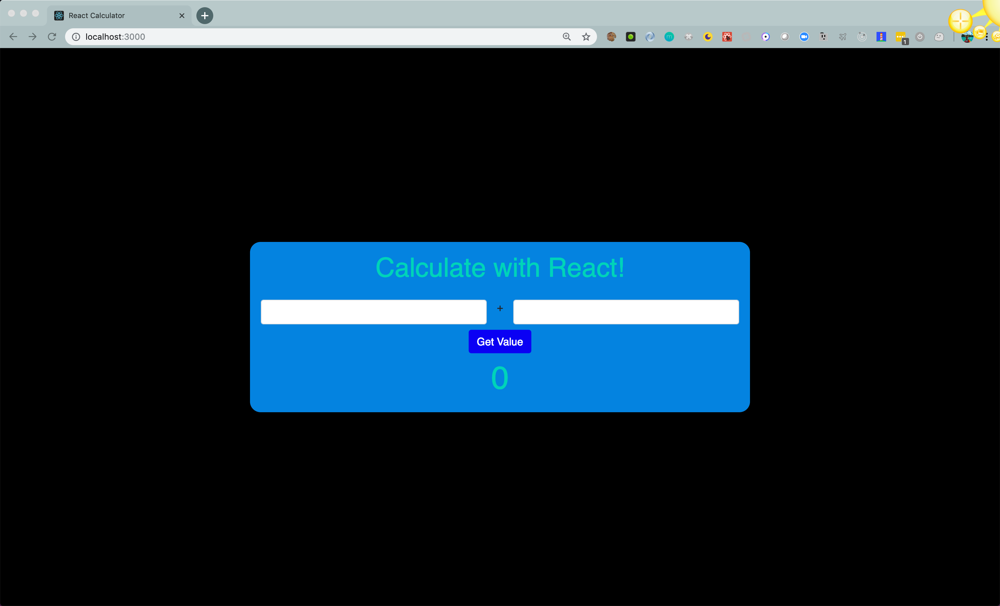
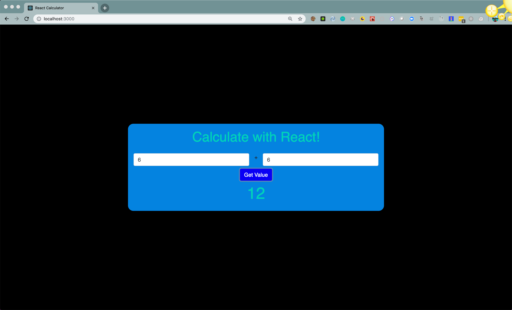

## 
<h1>Let's Build a Calculator</h1>

Now let's throw you into the wild with no starter code!

You'll be creating a functional calculator using `state` and `onClick` handlers.

**Requirements:**

- You must build an app that takes in two values and returns the proper value.
- Make sure it's a good looking calculator - aka use the styling you've been practicing.
- Consider all prior feedback you've gotten and implement it into this app.
- Use lots of comments in your code to explain what you're doing.
- You can use `onChange` to update the value as they are added, or you can run the function `onSubmit`

**Stretch Goals:**

- Create buttons that add, subtract, divide and multiply.
- Create a list that documents all calculations done before a page is refreshed.
- Create a reusable input component that will take in props and utilize them multiple times.

**Super Stretchy Ninja Goal**

- Make buttons for all numbers and operations, like a traditional calculator!
